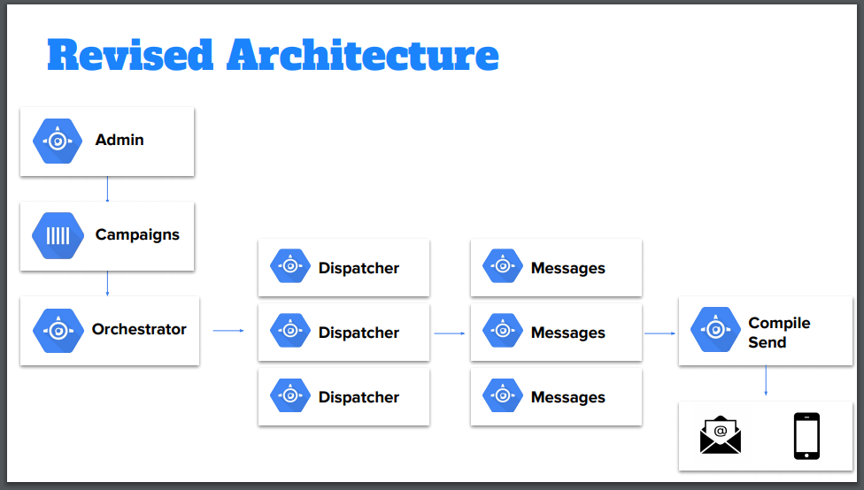

# Building for rapid scale: a deep-dive into the new york time messaging system
*Speaker: Aikaterini Iliakopoulou @ NYT*

## Why messaging is important at NYT?
- 53 Newsletters
- 4.2 Billion email to subscribers
- Push notification:
    - 7 channels
    - 50 million devices

- Messaging is a great way to engage with their readers
- Communication works both ways (the reader select what he wants to receive)

## Messaging at the NYT ?
### Legacy systems;
- Newsletters platform
    - On GCP / Go
- Push notifications
    - On AWS / PHP

### New platform capabilities (Go + GCP):
- Subscribe users to producter
- Administer product, campaigns, audience, schedules and messages
- Send a campaign
- Reporting

The entire architecture is event driven.

Microservice:
- Admin: "Morning briefing has been scheduled for 6 am"
- Triggers an event to the queue.
- Dispatcher receive the event.
    - From the event, it gets the target audience.
- *Compile and send* is a services that is in charge of doing the *mailing* and *push notifications*
- Reporting + Delivery logs

All the data is in big query.

### Why build it in-house?
- Control of our data and our users data
- Light Vendor lock-in
- Flexibility in developing new feature

## Demand for a better system
Largest newletter had 2 millions subscribers, SLA to deliver: 10 minutes.
By the end of 2019, it grew up to 9 millions and SLA was still 10 minutes.

## Building for Rapid Scale
### Scale how we dispatch the audience
- Must know state : A campaign should not fail because of a DB failure.
- Must process all rows in 1 minutes
- Must retry to load if request fail

How was the query adapted to dispatch: by subscription timestamp (time window)

Divide and Conquer : Looks for windows in time, keep splitting the number of rows until we get 500k rows per operator. Once that daterange is found, store it somewhere and query accordingly.

### Scale how we send messages
Newletters: Process 1 email/request
Push notification: Process batch of messages / requests

Throughput : Number of Instances * request/instance

## Performance
### Setup
Max number of devices / Users Id: 1 Millions
Numbers of Pub/Sub: 15 (1000req/sec)

## Revised architecture

## Looking to the future
To reduce the cost they are considering migrating from Google App Engine to GKE. 

[Complete presentation](https://cdn.oreillystatic.com/en/assets/1/event/307/Building%20for%20rapid%20scale_%20A%20deep%20dive%20into%20the%20New%20York%20Times_%20messaging%20platform%20Presentation.pdf)