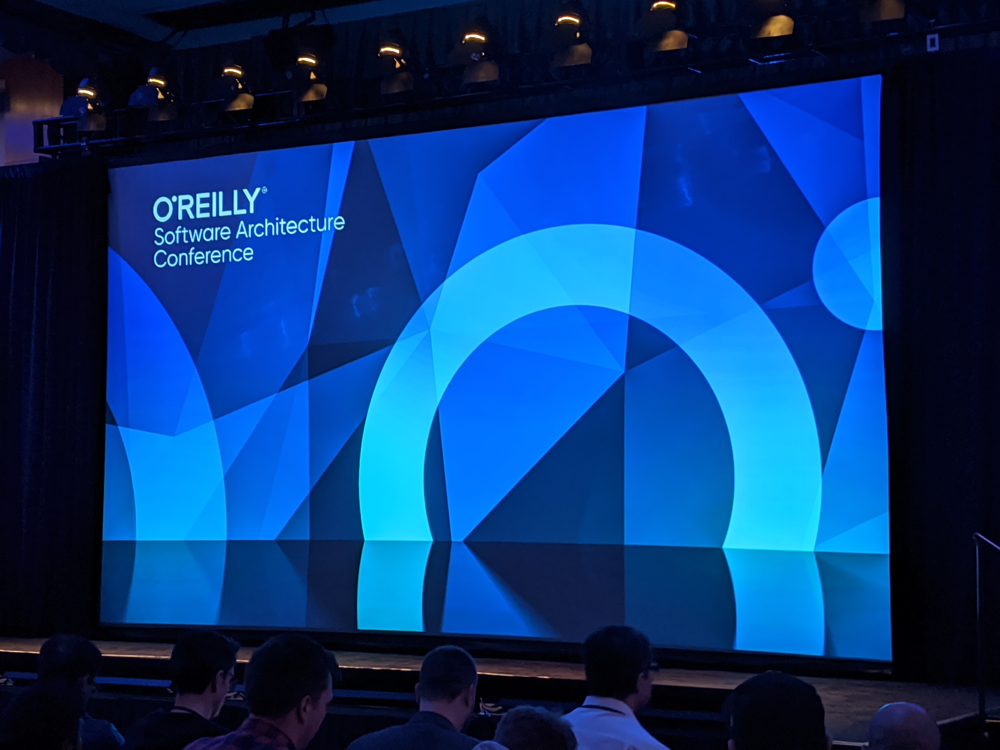

# Day 1 - Opening Ceremony

## Sometimes I draw
*Speaker: Kai Holnes @ Thoughtworks*

Things we do to improve:
- Repetition : Do our stuff over and over again (more architecture, more coding) 
- Forming connections :  Research on new technologies 
- Fill gaps : Getting outside advice (going to a conference, talking to people, outside perspective)

The activity is important but so is the journey which usually goes throught these phases: 
- Total Failure
- It's okay
- Ehhh?
- Never again...
- It'll work for now

Having creative hobby helps find new perspective. Don't underestimate how creative you are.

## The elephant in the architecture
*Speaker: Martin Fowler @ Thoughtworks*

### What is the business value of this system ?
Person aren't aware of the business value of their systems. 

Microservices isn't the answer for everything. If you don't have the experience, the monolith can be better. 

**Use value stream mapping (VSM)**
- Not just about money
- Look at other aspects of value (e.g. customer satisfaction)
- Fire impact :
    - Where can things go wrong and what are the consequences of that ?
    - e.g. Going throught the scenario of a database restore, ask the question: "How long can the system be down on black friday ?".  

Does consistency or availability is more important ? It becomes a business decision.
- Do we prefer to have a double booked hotel room or no booking getting throught ?

**Tips**
- In ADR, includes the business case to keep a record on why it was decided like that. 
- As an architect or tech lead it is important to note the bias.
- Do build a relationship with the business people. 

## From the trenches : Closing remarks
*Interview: Neil Ford->Rachel Laycock both @ Thoughtworks*

**Biggest problem we all have:**
- Silver bullet thinking.
    - Applying the solution to a problem to all problems.
- If we don't look at mistake of the past, we'll keep repeating the same history.
