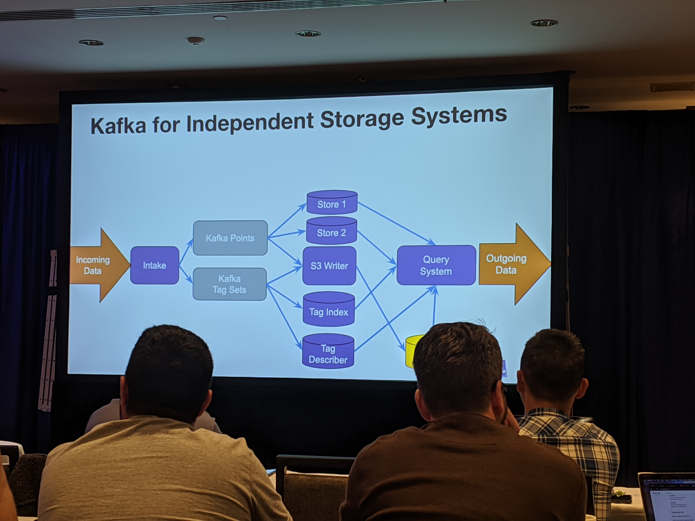

# Datadog: Real-time metrics database for trillions of points/day
Joel BARCIAUSKAS @ Data dog

Datadog is an observalability and monitoring platform. 

What is driving this amount of data: moving from the datacenter world->cloud/vm->containers->lambda and serverless function.

At the same time, we're increasing the granularity of that data. 

## Architecture
- Exemple of metrics query: "What is the system load on instance i-xyz for the last 30 minutes?"
- Tags for all the dimensions
    - Host/container metrics
    - Application: internal cache hits rates, timers by module
    - Service: hits, latencies or error by path or response code
    - Business: # of orders preocessed, $'s per second by CustomerId

Optimizing:
- Query caching in front of the query system. 

### Kafka for independant storage system 

Scaling through Kafka
- Partition by customer, metric, tag set
    - Isolate by customer
    - Scale concurrently by metric
    - Building something more dynamic

## Deep dive in datastores
- Do it less: only index what you need.

Technology used: LevelDB, Redis, Cassandra, RocksDB + SQLite

## Handling synchronization
Alerts / Monitors synchronization
- Required to prevent false positives.
    - Customer stop sending the data, is it what the customer wanted to do or it just stopped working ? 
- Injected heartbeat before the intake and post the query system they can get the expected latency.

**Build the minimal synchronization possible**

## Approximation for deeper insights
Types of metrics:
- Counter, aggregate by sum
- Gauges, aggregated by last or average
- Distribution metrics:
    - Aggregated by %tile or SLO (count of value above or below a threshold)

Add aggregation points:
- If we receive multiple metric during the same second, avg it instead of sending multiple points
- From the query system, what does the user want to see.
- **Pre-Aggregate your data**

Sketches:
- Data structures designed for operating on streams of data
- e.g. HyperLogLog
    - Cardinality / unique count estimation
    - Used in Redis PFADD, PFCOUNT, PFMERGE

Others: Bloom filter(set membership), frequency sketches (top-N list).