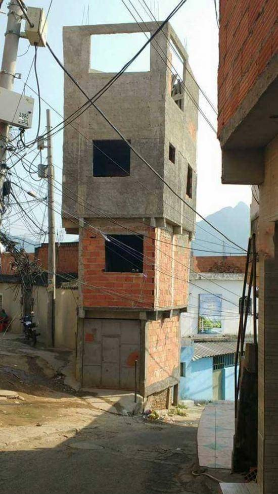
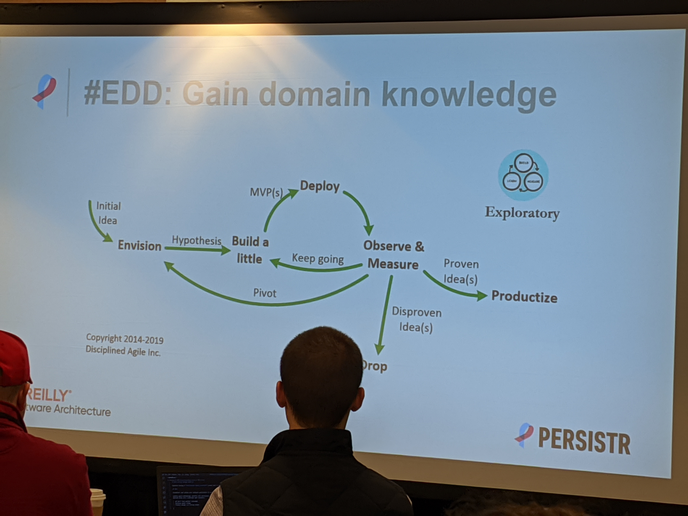
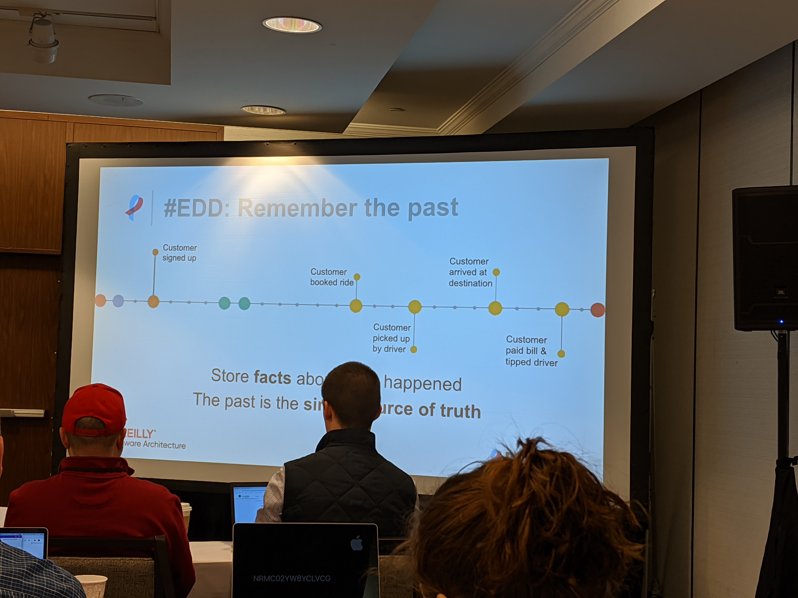
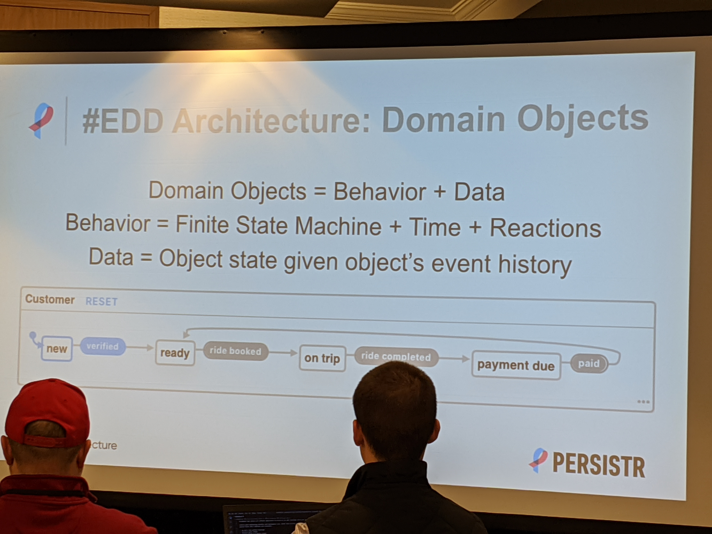
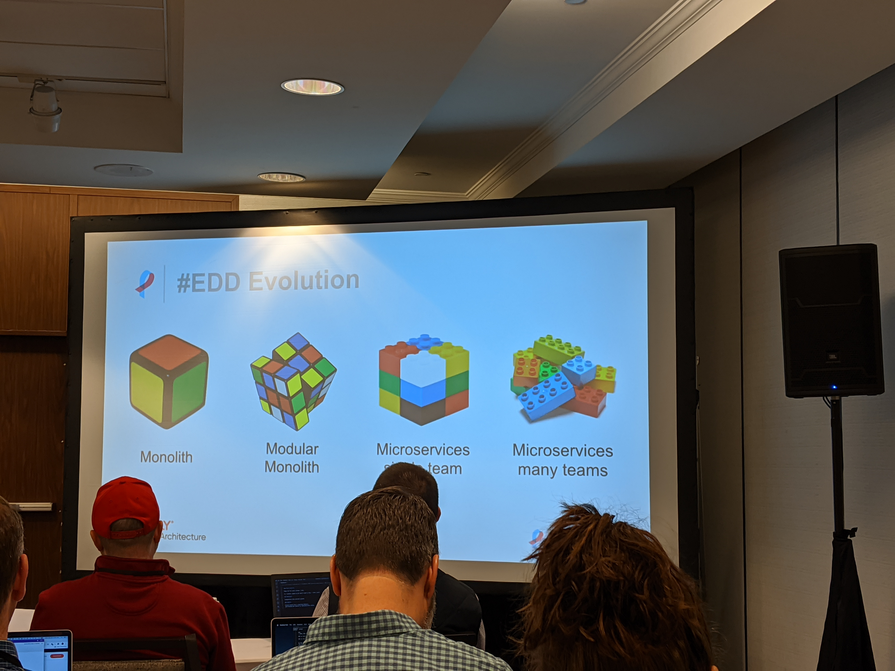

# Event Driven Development (EDD) - Monday @ 9h00am
## What is EDD
Specific methodology for developing software using combined techniques of DDD, ES, CQRS, Actor and Statecharts. It requires a distributed object-oriented system that is programming language independent.

## Why Event design ?
EDD is the foundation that allow your software to evolve as you gain knowledge in your business domain.

Software is complex, perfect knowledge upfront is hard

Agile : Managing changes is hard, and you can often ends up with mutant project. e.g.:

EDD = Agile product & project managament + maintanable

- We don't have perfect knowledge
- Business goals change
- Product design is a moving target

Given we want working software, and have imperfect knownledge when we get new knowledge how can we make the application evolve.

EDD is the foundation that allows your software application to evolve as we gain business knowledge.

## EDD Principles
- Embrace change
- Gain domain knowldege
- Involve everyone
- Remember the past
- Act on and learn from the past

## EDD : Embrace change
**Software systems must evolve over time or become incresingly irrelevant**

- Practice Continuous Improvement

- Codify your knowledge in executable **BDD** scenarios (as document won't be updated and nobody will look at them)

Given Pattern of past events -> When... executing command -> Then... expect new event

## EDD: Involve everyone
- Workshop
- Make sure everyone is on the same page
- Focus on the business domain, what events can occur ?
- Store fact about what happened + the past is the single source of truth

### Act on & learn from the past
{User, Integrations, Future} -> Event Stream -> {Analytics, Reactions, Projections, Future, Predictions}
You persist your event stream to a database.

## Architecture of an EDD
- Domain object: Business Logic = Behavior + Data
- Behavior = Finite Satte Machine + Time + Reactions
- Data = Object state give object's event history
- External integrations
- Projections: queries, analytics, predictive models, micro-services

### Commands
Request for a domain object to change it's state
Domain objects decides to accept or reject a command
Result of processing a command is a domain event

### Domain events
Each domain event represents a change in state of a domain object
The data needs to be easily changeable (SQL add a complexity)
Storage used for the events must be flexible enough

### Event patterns
Regex but for event streams + time
- Customed signed up but hasn't taken a ride => offer coupon
- Compare arrival times against planned => detect deviations

### Reactions
Invoke actions on external systems
- Stripe / payment processing

### Queries
**Project events** onto a **reporting database**.
Wipe anytime and rebuild by replaying event stream.

## Evolution of and event-driven design system

- Programming language independant
- Unlimited domain objects, projects, and reactions
- Add new microservices over time

